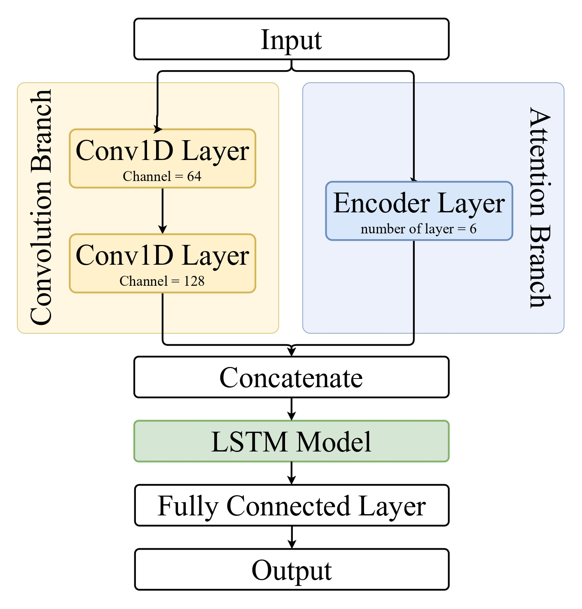
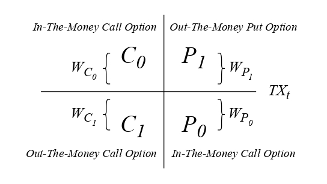
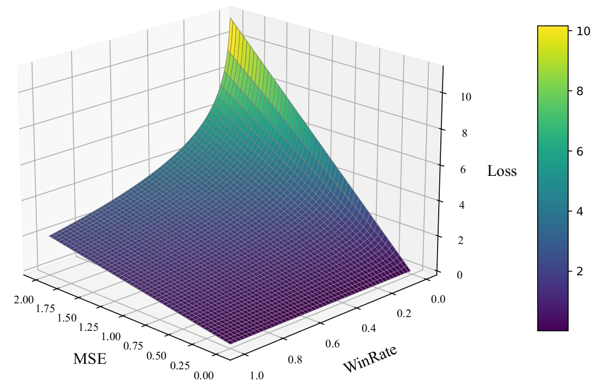

# FusioNet

FusioNet - A deep learning architecture specifically engineered for financial time series data.

## 1. Architecture and Features

### Core Features
FusioNet is a multi-branch fusion neural network architecture designed for financial time series data. Its key features include:

* **Multi-module Feature Fusion**: Organically combines Convolutional Neural Networks (CNN), Transformer models, and Long Short-Term Memory (LSTM) networks to simultaneously capture local short-term volatility features and global temporal dependencies in financial data.
* **Modularity and Scalability**: Specifically designed for complex, non-linear, and volatile financial instruments (e.g., options, futures), providing excellent architectural flexibility and room for expansion.

### Network Design
FusioNet adopts a parallel dual-branch design, followed by sequential integration modules:

1. **Convolution Branch**:
   * Composed of 1D convolutional layers.
   * Used to extract local short-term features in the time dimension (e.g., micro-oscillations, local reversals, and other technical patterns).
2. **Attention Branch**:
   * Composed of stacked Transformer encoders.
   * Utilizes self-attention mechanisms to capture global cross-time-step correlations and long-range temporal dependencies.
3. **Concatenate Layer**:
   * Merges the outputs from the Convolution and Attention branches, enabling the model to account for both local details and global context.
4. **LSTM Modeling Layer**:
   * Feeds the fused features into stacked LSTM modules for further sequence modeling, enhancing the memory of continuous features across time points.
5. **Output Layer (Fully Connected Layer & Output)**:
   * Maps features to the target dimension through fully connected layers to output the predicted ATMS value for the next time point.

  
   
  <b>Figure 1: FusioNet Architecture</b>

## 2. ATMS (At-The-Money Synthetic)

### What is ATMS?
In real-world options markets, due to fixed strike price intervals, it is often difficult to find an option contract with a strike price exactly equal to the current spot price (the "true" At-The-Money contract) when the index fluctuates.

To bridge this theoretical and practical gap, this research precisely defines the **ATMS (At-The-Money Synthetic)** index. This index dynamically weights the prices of the nearest available contracts to comprehensively reflect the market's overall expectation of future volatility, capital concentration, and the tension between bulls and bears.

### Calculation Mechanism
The ATMS calculation is based on **linear interpolation** and includes an **intrinsic value deduction mechanism**:

1. **Contract Selection**: Select the four contracts closest to the current market index ($TX_t$):
   * First ITM Call ($C_0$), First OTM Call ($C_1$)
   * First ITM Put ($P_0$), First OTM Put ($P_1$)
2. **Dynamic Weighting**: Calculate weights ($W_{C_i}$, $W_{P_i}$) using linear interpolation based on the absolute distance between the strike prices and the current market index.
3. **Time Value Purification**: Deduct the "Intrinsic Value" from the premiums of these four options to exclude the linear impact of market index movement, retaining only the "Time Value" that reflects volatility expectations.
4. **Weighting and Normalization**: Sum the weighted time values, normalize by the current market index ($TX_t$), and multiply by 100 for better observation and model fitting.

$$\text{ATMS}_t = \frac{100}{TX_t} \sum_{i=0}^1 \left( W_{C_i}(C_i - TV_{C_i}) + W_{P_i}(P_i - TV_{P_i}) \right)$$

> *Note: The $(C_i - TV_{C_i})$ term represents the pure time value after deducting intrinsic value.*

  
   
  <b>Figure 2: ATMS Calculation Logic</b>

## 3. Experimental Design and Model Training

### Input and Output Features
* **Input Features**: A total of **44 feature fields** covering multi-dimensional market information:
  * **Futures Data**: Open, High, Low, Close, Volume, Rate of Change, etc.
  * **Market and Volatility Features**: Weighted Index, Realized Volatility.
  * **ATMS Derivatives**: Current ATMS value, statistical features (Moving Averages, +/- Standard Deviations).
  * **Time Features**: Time to expiration, time intervals.
* **Output (Label)**: The model predicts the actual ATMS value for the next time point ($t+1$), framed as a continuous variable regression task.

### Custom Loss Function
In options trading, minimizing Mean Squared Error (MSE) alone can lead to the "numerically close but directionally opposite" trap. We designed a hybrid loss function combining **"Magnitude Error (MSE)"** and **"Directional Win Rate"**:

$$\mathcal{L} = \mathcal{L}_{\text{MSE}} \cdot \left(1 + \lambda \cdot [-\log(\text{WinRate} + \epsilon)]\right)$$

* **Penalty Mechanism**: If the predicted direction is wrong, the WinRate drops, and the negative logarithmic term increases significantly, forcing the total loss to rise exponentially. This guides the model to balance numerical accuracy with trend judgment.

  
   
  <b>Figure 3: Loss Function Surface</b>

### Data Preparation and Structure Requirements

To ensure consistency in strategy development and execution, the foundational datasets are specified as follows:

| Data Source | Frequency | Key Fields |
| :--- | :--- | :--- |
| **TAIEX Index** | 1-min | `date`, `time`, `open`, `high`, `low`, `close` |
| **TAIEX Futures** | 1-min | `date`, `time`, `contract`, `open`, `high`, `low`, `close`, `vol` |
| **TAIEX Options** | 1-min | `date`, `time`, `contract`, `strike_price`, `cp`, `open`, `high`, `low`, `close`, `vol` |

### Workflow Execution

The project is structured into four sequential Jupyter Notebook modules to ensure experiment reproducibility:

### === Data Cleaning === (`1_data_processing.ipynb`)
Initial cleaning of raw TAIEX index and futures data. Procedures include filtering non-trading hours.

### === ATMS Feature Calculation === (`2_calculate_ATMS.ipynb`)
Focuses on core indicator calculation. It uses futures prices to calibrate option strike levels and compute **At-the-Money Synthetic (ATMS)** values.

### === Statistical Feature Extraction === (`3_calculate_std.ipynb`)
Performs statistical analysis on ATMS indicators. Includes calculating rolling historical averages/standard deviations features.

### === Model Training === (`4_FusionNet_Training.ipynb`)
Imports the processed feature matrix into the **FusionNet** deep learning model. The model learns the relationships between underlying futures and indicators to output volatility trend predictions.

## 4. Practical Quantitative Trading Applications

Predicting ATMS changes informs dynamic decision-making for volatility strategies:

* **Rising ATMS (Rising Implied Volatility)**:
  * Indicates expected sharp volatility.
  * **Trading Strategy**: Deploy volatility expansion strategies (e.g., **Long Straddle**) to profit from premium surges.
* **Falling ATMS (Falling Implied Volatility)**:
  * Indicates range-bound markets or volatility convergence.
  * **Trading Strategy**: Switch to time-value collection strategies (e.g., **Short Straddle**) to profit from accelerated theta decay.
* **Optimization and Risk Control**:
  * **Signal Filtering**: Combine filters (e.g., expected profit > 5 points, restricted trading hours).
  * **Risk Management**: Dynamic stop-loss and take-profit mechanisms to optimize profit-to-loss ratios.
